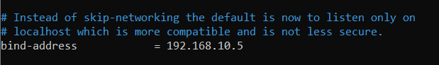
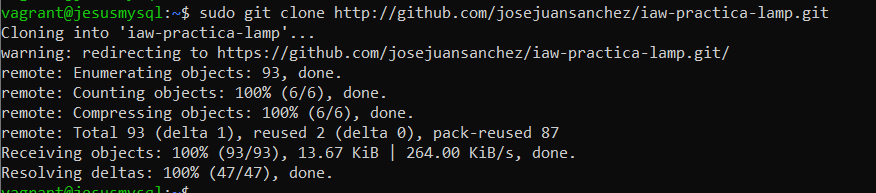
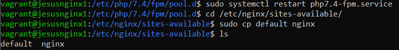
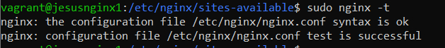

# BALANCEADOR CON NGINX
## Scripts de aprovisionamiento de todas las maquinas
### Scrip de aprovisionamiento para Mysql

### Scrip de aprovisionamiento para Nginx

### Scrip de aprovisionamiento para el Balanceador

## CONFIGURACIÓN MYSQL
### Lo primero será acceder al directorio **/etc/mysql/mariadb.conf.d** y editar el fichero de configuración **50-server.cnf**

### En el fichero de configuración cambiamos la *bind-address* por la ip de la máquina Mysql

### Tras esto utilizamos el comando *mysql_secure_installation* para asignarle una contraseña al root

### Iniciamos sesión como root en mysql y creamos el usuario *lamp_user*

### Con el comando **sudo git clone** clonamos el repositorio en nuestra máquina

### Nos vamos a la ruta *iaw-practica-lamp/db* y cargamos la base de datos

### Una vez cargada la base de datos volvemos a iniciar sesión como root y le damos todos los privilegios al usuario anteriormente creado. Tras esto recargamos los privilegios

## CONFIGURACIÓN NGINX
### Primero vamos a la ruta */var/www* y creamos una carpeta. Cambiamos el propietario de dicha carpeta a **www-data**

### Dentro de la carpeta clonamos el repositorio remoto

### Nos vamos a la ruta *iaw-practica-lamp/src* y movemos todos los archivos de ese directorio a la carpeta creada anteriormente

### Editamos el fichero *config.php* y añadimos la ip de la máquina de Mysql

### Lo siguiente es ir a la ruta **/etc/php/7.4/fpm/pool.d** y editamos el archivo *www.conf*

### En este archivo buscamos la línea donde pone *listen* y la cambiamos

### Restauramos el servicio. Nos vamos a **/etc/nginx/sites-available** y hacemos una copia del archivo *default*

### Editamos la copia añadiendo la ruta de la carpet anteriormente creada a la línea *root*, añadimos *index.php* para que pueda detectarlo y descomentamos varias líneas

### Creamos un enlace de la copia hacia **sites-enabled** y borramos el archivo *default*

### Con el comando *sudo nginx -t* comprobamos que todo está correcto

### Ya solo queda restaurar nginx y hacer todo lo anterior de nuevo en otra máquina Nginx
## CONFIGURACIÓN BALANCEADOR
### Vamos a **/etc/nginx/sites-enabled** y borramos el archivo *default*

### Con el comando **sudo nano /etc/nginx/conf.d/balanceador.conf** creamos el archivo *balanceador.conf* y lo rellenamos con estas líneas, donde declaramos las ip de las máquinas conectadas al balanceador, el nombre del servidor, el puerto, etc...
